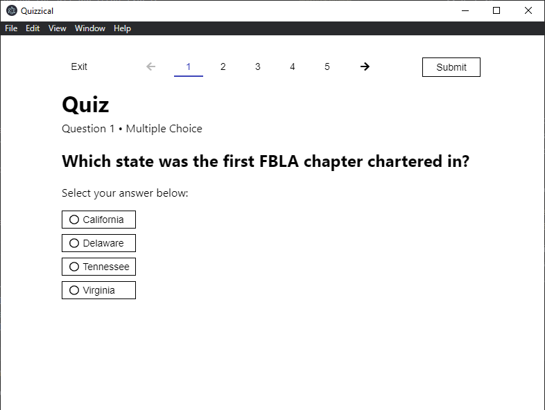

# Quizzical

**&copy; 2021 Ryan Zhang** - Licensed under the [MIT License](license.md)*

Quizzical is my submission to FBLA's 2021 Coding and Programming event. 

This readme file provides technical documentation on how to build/run Quizzical from source code, as well as instructions on extending Quizzical's functionality. 

*\*After July 3rd, 2021 (the conclusion of FBLA NLC 2021). Until then, all rights are reserved to preserve competitive integrity.*

## Technical Background
Quizzical is built using the open source [Electron](https://www.electronjs.org/) framework, allowing it to run on all major desktop operating systems (Windows, Linux, and MacOS) with equivalent functionality. [Electron Forge](https://www.electronforge.io/) is used to handle development and builds. 

[NodeJS](https://nodejs.org) is required as a development dependency because of this, but users do not need it installed on their machines when running production builds as it's packaged into the app. 

## Core Features
### Running Quizzical
Production builds can be run by directly launching the executable. 

Development builds can by run using `npm start` in the app directory. If development dependencies are not yet installed, they can be installed using `npm install`. 

*Note: NodeJS v12 or later is required for development.*

### Building Quizzical
Quizzical comes with a `make` command to turn Quizzical into a production build (that can run on its own, without external dependencies). 

You can build Quizzical using `npm run make`. 

### Quizzical Help Pages
End user help is available in the interactive help menu, accessible using the "Help" button in the toolbar. Questions are categorized by topic, and users can click on common questions to recieve more information in a separate page. 

## Advanced Features
### Modifying Questions
Questions are stored in a plain text file located under `src/questions.txt`, which is loaded into the application's memory upon startup. This makes it extremely easy to add, edit, or delete questions from the application. You can even make it about something completely unrelated to FBLA! 

Question information is written in a semicolon delimited format, with the first "column" denoting the question type. For example, a multiple choice question begins with `mc`. Refer to the table below for all quesiton types: 

|Type|Description|
|-|-|
|mc|Multiple Choice|
|tf|True/False|
|sa|Short Answer|
|o|Ordering|
|n|Numerical|

After the question type, write out the question text, another semicolon, and then the answer to the question. In the case of multiple choice questions, additional options can be listed (again, semicolon delimited) after the answer. Quizzical will shuffle the answer options, so don't worry that the correct answer is always first in the file!

#### Example
Let's break down the first question in the questions.txt file: 

`mc;Which state was the first FBLA chapter chartered in?;Tennessee;Virginia;California;Delaware`

The first "column" tells us that this is a multiple choice question. This is followed by the question itself (*Which state was the first FBLA chapter chartered in?*) and then the answer (*Tennessee*). Lastly, additional (incorrect) multiple choice options are listed - all separated by semicolons (*Virginia;California;Delaware*). 

In Quizzical, this question would render like this: 

### Extending Quizzical
All significant portions of code are well documented to make extending Quizzical easy. Here's a list of important files to be aware of when modifying the application: 

- Questions are stored in `src/questions.txt`. Refer to the section above for more details. 
- Per Electron convention, the bulk of the code is written in the renderer script, located under `src/window.js`. This file is responsible for nearly everything you see in the window, and all its functions are documented to make extending/modifying easy. 
- The backend, "privileged" script is located under `src/index.js`. This code is responsible for lower-level functionality such as creating the application window, displaying the menu bar, and showing system dialogs. The code here is minimal (but still documented) as it has full application-level permissions (i.e., arbitrary filesystem reading/writing). 
- The Vue template is in `src/index.html`. On its own the index.html file is merely the "backbone" of the application, as it is the scripts that make it functional. Nonetheless, comments are included with a brief description of each page and what said page does. 
- CSS is stored in `src/index.css` and is responsible for the aesthetics. 
- Third party libraries are stored under the `src/lib` directory. 
- The interactive help menu is its own separate "app", located under the `src/help` directory. It is designed to run standalone - separate from the rest of the application. 